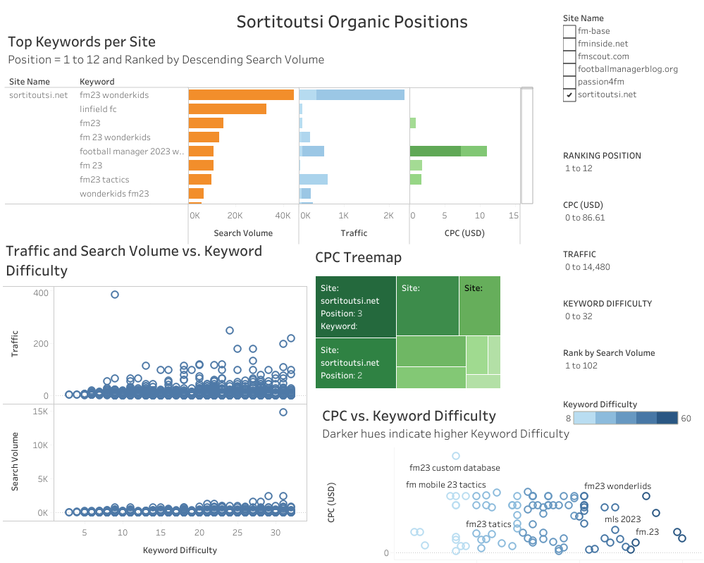

# Sortitoutsi_Keyword_Research
Analyzing SEMRush search keyword data captured for Sortitoutsi.net on October 2023 using Excel, R, SQL and Tableau.

# Overview
This repository contains the data analysis project "Keyword Research for Sortitoutsi.net," based on [SEMRush](https://www.semrush.com) data captured in October 2023. The project focuses on understanding the keyword landscape for Sortitoutsi.net, a community website servicing the Football Manager gaming community, through the lens of SEO, SERP features, and search intent. The analysis is aimed at driving actionable insights to optimize organic traffic and improve the site's visibility in search engines.

This project focuses on an in-depth keyword research analysis for Sortitoutsi.net, a leading site dedicated to Football Manager content. The goal is to uncover insights into keyword performance, search efficiency, and site traffic that can guide content strategy and improve search engine rankings. The analysis was performed using R for data wrangling and analysis, with results visualized in Tableau.

# Project Structure
* **Data Sources**:

    * SEMRush keyword data for Sortitoutsi.net and its competitors in CSV format.

* **Objectives**:

    * Identify high-performing keywords driving traffic to Sortitoutsi.net
    *  Analyze keyword difficulty, search volume, CPC, and search intent
    * Provide actionable recommendations to enhance site visibility and user engagement

# Key Analysis and Insights
## Keyword Categorization
The top 100 keywords were categorized into six main groups:

* Game Assets
* Wonderkids & Best Players
* Player Stats & Profiles
* Clubs & Leagues
* Tactics & Formations
* Brand & Identity

The analysis revealed that the "Brand & Identity" category holds significant search volume and efficiency, indicating strong domain authority. In contrast, categories like "Wonderkids" and "Game Assets" show potential for growth in search efficiency.

## SERP Features and Search Intent
Analyzed the SERP features associated with Sortitoutsi.net's top-ranking keywords. Sitelinks, Video, and Reviews emerged as the most common features, indicating a strong presence in search results. The study of search intent revealed that a large portion of the keywords are informational, providing opportunities to enhance content tailored to user needs.

## CPC Analysis
The cost-per-click (CPC) analysis demonstrated that Sortitoutsi.net saves **$7,487.92** per month in advertising costs by maintaining organic rankings. Specific categories like "Wonderkids" and "Tactics" offer the highest potential CPC value, presenting opportunities to monetize content further.

## URL Performance
A concentrated set of 42 unique URLs drive the majority of the site's traffic. Optimizing these pages and reducing keyword cannibalization could further enhance traffic flow and site authority.

## Recommendations
* **Focus on Expanding Game Assets and Wonderkids Content**: Given the high traffic and efficiency, there is potential to expand content in these categories, improving search visibility and user engagement.
* **Optimize for High-Impact SERP Features**: Enhance content to align with common SERP features like Sitelinks and Videos to increase click-through rates.
* **Target Low-Competition Keywords**: Prioritize keywords with lower difficulty scores but high search efficiency to capture more organic traffic with less competition.
* **Reduce Keyword Cannibalization**: Consolidate content where multiple URLs compete for the same keywords to strengthen individual page authority.
* **Explore Monetization Opportunities**: Focus on high-CPC keywords like those in the Wonderkids and Tactics categories to explore potential monetization strategies.

## Repository Structure
* `data/`: Contains the original CSV files and associated database files used in the analysis.
* `notebooks/`: Jupyter or Quarto notebooks documenting the analysis process.
* `reports/`: Generated reports, including the Final Report and 
Summary.
* `notebooks/Sortitoutsi_Keyword_Research.qmd`: The main analysis document written in Quarto, detailing the entire keyword research process.
* `reports/Project_Overview_and_Insights.md`: Front-end document with generalized project information.
* `README.md`: This document.

# How to Use This Repository
1. Clone the repository to your local machine.
2. Review the `README.md` for an overview of the project.
3. Explore the `notebooks/` directory to see the detailed analysis and code.
4. Review the `reports/` for a summary of insights and recommendations.
5. Peruse the accompanying [Tableau Dashboard](https://public.tableau.com/app/profile/terry.bates4031/viz/Sortitoutsi_netOrganicPositions/SortitoutsiOrganicPositions) to surface keyword research data.

